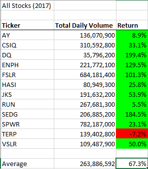
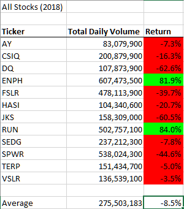
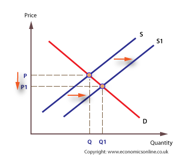
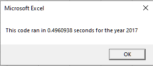
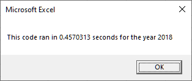
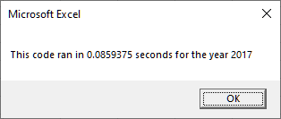

# Stock-Analysis


## Overview
The motivation of this project is to analyze stocks in the green technology sector based upon 2 important metrics: annual trading volume and annual return. To accomplish this goal, we used a data set that represented the daily trading metrics of 12 green-tech stocks and then aggregated this data in order to gain insight into yearly trends. This analysis was performed for 2017 and 2018 using VBA Macros.

## Results
## Analysis of Stock Prices
From the below tables we can clearly see that 2017 was a much better year for the green tech sector than 2018, as the average return clearly shows. If we compare the volumes across both years we see that some stocks, such as DQ or VSLR, lost value but saw an increase in trading volume. At first this seems counter intuitive but by employing economic analysis we see that a decrease in price and an increase in quantity traded (daily volume) can be attributed to an increase in supply (see graphical analysis below). Using DQ as an example, we see that this means those who bought the stock in 2017 thought the 199.4% increase meant the stock was over-valued, in response these buyers began to sell their stock; as the market corrected for this overvaluation, the additional supply from these stock owners further depressed the price leading to the large loss that DQ suffered in 2018 (-62.6%). We also notice that a large piece of the overall trading volume is due to 2 stocks: ENPH and RUN. These two stocks outperformed by over a margin of over 80% and this is reflected in a high demand, which translates to a higher trading volume. If we look at ENPH for example we see that it had a 129.5% increase in return followed by a 81.9% increase in 2018, outperforming the market in both years. While at first glance this may seem to suggest that it is a good buy, it is actually not. This is for two reasons: regression to the mean, and that generally it is more advantageous to buy stocks which are undervalued. When looking for stocks to buy at the end of 2018 a stock like SPWR would make more sense as it trades with high volume and, over both years lost %21.5 of its value. It is unlikely that a company not only failed to grow but lost 21.5% of it's book value over 2 years; we can assume this is an overcorrection and the price will likely go up in 2019.

 



## Analysis of Run-Time
When we compare the run-time of the original code and the refactored code (attached below) we see a significant improvement after refactoring. These translate to saving time by a factor of about 5.8 and 5.3 for 2017 and 2018, respectively. 

### Original Run-Times
 
### Refactored Run-Times
 

These time savings come from the fact the code has been restructured such that it only loops through every row of the spread sheet instead of looping through every row, for each ticker symbol. This rum-time improvement has a cost in terms of memory usage but we will investigate this more thoroughly in the summary section along with how the time and space complexities scale with input size.

## Summary
In this section we will be using the concept of Big-O notation in order to describe the how the refactoring changed the time and space complexity of the original algorithm and how this translates to advantages, for the formal definition of Big-O notation we refer the reader to the [Wikipedia article](https://en.wikipedia.org/wiki/Big_O_notation#Formal_definition) for a formal definition. First we note that the number of rows is actually given by `251*n` where n is the number of tickers (confirmed using excel's `=COUNTIF()`). Since we are performing big-O analysis we can remove the constant and use the number of tickers to describe the input size of the data set, from here on we let it be `n`. Let us consider how the  refactored code and original code loop through the data as these are the code blocks which determine time complexity:
 
 ### Original Code
 ```vba
 Sub AllStocksAnalysis()
  'the array which holds the tickers
  Dim tickers(12) As String 
  tickerLoop = 11 'this is the number of tickers (n)
  'number of rows in the sheet or 251*n
  rowLoop = Cells(Rows.Count, 1).End(xlUp).Row 
  For i = 0 To tickerLoop
    'store the ticker symbol and activate the worksheet
    For j = 2 To rowLoop
      'calculate total volume and total daily return for the i-th ticker symbol
    Next j
   Next i
 ```
 In this code block the outer loop runs n times and the inner loop runs `251*n` times this means that the time complexity can be given in big-O notation as O(n<sup>2</sup>). We should also note that the ticker symbols are held in an array `tickers(n)`. The space complexity can be given as O(n) since we use one array of size n.
 
### Refactored Code
```vba
Sub AllStocksAnalysisRefactored()
 Dim tickers(12) As String 'the array which holds the tickers
 RowCount = Cells(Rows.Count, "A").End(xlUp).Row 'number of rows in the sheet or 251*n
 Dim tickerVolumes(12) As Long 'array to record the total volumes of each ticker
 'the following 2 arrays are used to calculate the yearly return of each stock
 Dim tickerStartingPrices(12) As Single 
 Dim tickerEndingPrices(12) As Single
 tickerIndex = 0 
 For i = 2 To RowCount
  'Calculate the total volume, starting price and ending price for the ticker at tickers(tickerIndex)
  'when we reach the last row of the ticker at tickers(tickerIndex) we increment tickerIndex
 Next i
```
 In this code block the loop runs `251*n` times however since we are interested in the order of the time complexity this is O(n). Additionally, this time there are 4 arrays all of size n, but again we are only interested in the order so the space complexity is O(n).
 
 ### Advantages and Disadvantages
  Ideally, the advantage of refactoring code is that one can reduce the time or space complexity of a program which results in huge savings in computational resources as n gets larger. If this cannot be accomplished sometimes one can also save resources by reducing the number of variables, comparisons, or resources in general that are used. Either of these can represent practical benefits but the former is of great interest when working with very large data sets. The disadvantages of refactoring is that it takes a programmer time to perform and there is no guarantee that a given piece of code will be able to be refactored so that it can capture these advantages. One might be wasting their time.
  
  However, in the case of this VBA script we were able to reduce the time complexity while only marginally increasing number of resources used. This means that as the number of tickers we are interested in gets larger and larger (i.e., if we wanted to look at every stock on the FTSE 500), we have significant time savings since our refactored program scales linearly and not quadratically. The disadvantage here is that we had to use 4 arrays of size n in the refactored code as opposed to only 1 array of size n in the original code. As n gets large the advantages of the time savings greatly outweigh the disadvantages of the increased memory consumption, which would only be a consideration on machines with limited memory or potentially with Big Data applications.
